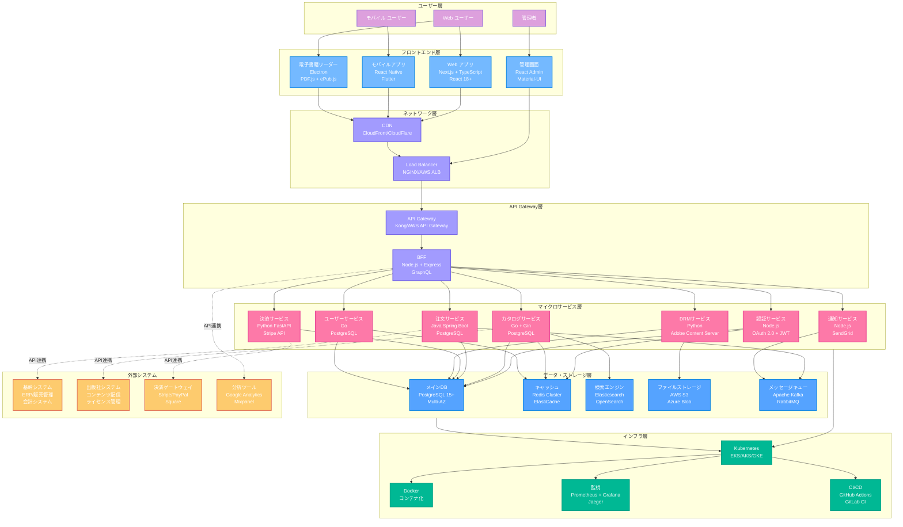

```mermaid
graph TB
    %% ユーザー層
    subgraph Users["ユーザー層"]
        WebUser[Web ユーザー]
        MobileUser[モバイル ユーザー]
        AdminUser[管理者]
    end

    %% フロントエンド層
    subgraph Frontend["フロントエンド層"]
        WebApp["Web アプリ<br/>Next.js + TypeScript<br/>React 18+"]
        MobileApp["モバイルアプリ<br/>React Native<br/>Flutter"]
        ReaderApp["電子書籍リーダー<br/>Electron<br/>PDF.js + ePub.js"]
        AdminPanel["管理画面<br/>React Admin<br/>Material-UI"]
    end

    %% CDN・ロードバランサー層
    subgraph Network["ネットワーク層"]
        CDN["CDN<br/>CloudFront/CloudFlare"]
        LB["Load Balancer<br/>NGINX/AWS ALB"]
    end

    %% API Gateway層
    subgraph APILayer["API Gateway層"]
        Gateway["API Gateway<br/>Kong/AWS API Gateway"]
        BFF["BFF<br/>Node.js + Express<br/>GraphQL"]
    end

    %% マイクロサービス層
    subgraph Services["マイクロサービス層"]
        AuthService["認証サービス<br/>Node.js<br/>OAuth 2.0 + JWT"]
        CatalogService["カタログサービス<br/>Go + Gin<br/>PostgreSQL"]
        OrderService["注文サービス<br/>Java Spring Boot<br/>PostgreSQL"]
        PaymentService["決済サービス<br/>Python FastAPI<br/>Stripe API"]
        DRMService["DRMサービス<br/>Python<br/>Adobe Content Server"]
        NotificationService["通知サービス<br/>Node.js<br/>SendGrid"]
        UserService["ユーザーサービス<br/>Go<br/>PostgreSQL"]
    end

    %% データ層
    subgraph DataLayer["データ・ストレージ層"]
        MainDB["メインDB<br/>PostgreSQL 15+<br/>Multi-AZ"]
        Cache["キャッシュ<br/>Redis Cluster<br/>ElastiCache"]
        Search["検索エンジン<br/>Elasticsearch<br/>OpenSearch"]
        FileStorage["ファイルストレージ<br/>AWS S3<br/>Azure Blob"]
        MessageQueue["メッセージキュー<br/>Apache Kafka<br/>RabbitMQ"]
    end

    %% インフラ層
    subgraph Infrastructure["インフラ層"]
        Kubernetes["Kubernetes<br/>EKS/AKS/GKE"]
        Docker["Docker<br/>コンテナ化"]
        Monitoring["監視<br/>Prometheus + Grafana<br/>Jaeger"]
        CICD["CI/CD<br/>GitHub Actions<br/>GitLab CI"]
    end

    %% 外部システム
    subgraph External["外部システム"]
        ERP["基幹システム<br/>ERP/販売管理<br/>会計システム"]
        Publisher["出版社システム<br/>コンテンツ配信<br/>ライセンス管理"]
        PaymentGW["決済ゲートウェイ<br/>Stripe/PayPal<br/>Square"]
        Analytics["分析ツール<br/>Google Analytics<br/>Mixpanel"]
    end

    %% 接続関係
    WebUser --> WebApp
    MobileUser --> MobileApp
    AdminUser --> AdminPanel
    WebUser --> ReaderApp

    WebApp --> CDN
    MobileApp --> CDN
    ReaderApp --> CDN
    AdminPanel --> LB

    CDN --> LB
    LB --> Gateway
    Gateway --> BFF

    BFF --> AuthService
    BFF --> CatalogService
    BFF --> OrderService
    BFF --> PaymentService
    BFF --> DRMService
    BFF --> NotificationService
    BFF --> UserService

    AuthService --> MainDB
    AuthService --> Cache
    CatalogService --> MainDB
    CatalogService --> Search
    CatalogService --> Cache
    OrderService --> MainDB
    OrderService --> MessageQueue
    PaymentService --> MainDB
    DRMService --> FileStorage
    DRMService --> MainDB
    NotificationService --> MessageQueue
    UserService --> MainDB
    UserService --> Cache

    Services --> Kubernetes
    DataLayer --> Kubernetes
    Kubernetes --> Docker
    Kubernetes --> Monitoring
    Kubernetes --> CICD

    %% 外部システム連携
    OrderService -.->|API連携| ERP
    CatalogService -.->|API連携| Publisher
    PaymentService -.->|API連携| PaymentGW
    BFF -.->|API連携| Analytics

    %% スタイリング
    classDef frontend fill:#74b9ff,stroke:#0984e3,stroke-width:2px,color:#fff
    classDef api fill:#a29bfe,stroke:#6c5ce7,stroke-width:2px,color:#fff
    classDef service fill:#fd79a8,stroke:#e84393,stroke-width:2px,color:#fff
    classDef data fill:#55a3ff,stroke:#0984e3,stroke-width:2px,color:#fff
    classDef infra fill:#00b894,stroke:#00a085,stroke-width:2px,color:#fff
    classDef external fill:#fdcb6e,stroke:#e17055,stroke-width:2px,color:#fff
    classDef user fill:#dda0dd,stroke:#9370db,stroke-width:2px,color:#fff

    class WebApp,MobileApp,ReaderApp,AdminPanel frontend
    class CDN,LB,Gateway,BFF api
    class AuthService,CatalogService,OrderService,PaymentService,DRMService,NotificationService,UserService service
    class MainDB,Cache,Search,FileStorage,MessageQueue data
    class Kubernetes,Docker,Monitoring,CICD infra
    class ERP,Publisher,PaymentGW,Analytics external
    class WebUser,MobileUser,AdminUser user
```