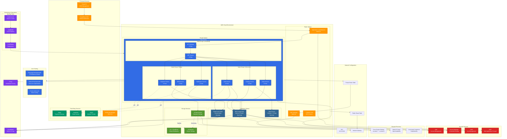

```mermaid
graph TB
    %% AWS クラウド環境
    subgraph AWSCloud["AWS Cloud Environment"]
        
        %% パブリックサブネット
        subgraph PublicSubnet["Public Subnet"]
            ALB["Application Load Balancer<br/>Multi-AZ"]
            NATGateway["NAT Gateway<br/>Multi-AZ"]
            Bastion["🔧 Bastion Host<br/>EC2 t3.micro"]
        end

        %% プライベートサブネット
        subgraph PrivateSubnet["Private Subnet"]
            
            %% EKS クラスター
            subgraph EKSCluster["EKS Cluster"]
                
                subgraph NodeGroup1["Node Group 1 (Services)"]
                    AuthPod["Auth Service<br/>3 Pods"]
                    CatalogPod["Catalog Service<br/>5 Pods"]
                    OrderPod["Order Service<br/>3 Pods"]
                end

                subgraph NodeGroup2["Node Group 2 (Data)"]
                    PaymentPod["Payment Service<br/>3 Pods"]
                    DRMPod["DRM Service<br/>2 Pods"]
                    NotificationPod["Notification Service<br/>2 Pods"]
                end

                subgraph NodeGroup3["Node Group 3 (Frontend)"]
                    BFFPod["BFF Service<br/>4 Pods"]
                    APIGatewayPod["API Gateway<br/>3 Pods"]
                end
            end
        end

        %% データベースサブネット
        subgraph DatabaseSubnet["Database Subnet"]
            RDSCluster["RDS PostgreSQL<br/>Multi-AZ Cluster<br/>r6g.xlarge"]
            ElastiCache["ElastiCache Redis<br/>Cluster Mode<br/>r6g.large"]
            OpenSearch["OpenSearch<br/>3 Master + 6 Data<br/>r6g.large"]
        end

        %% ストレージ
        subgraph Storage["Storage Services"]
            S3Main["S3 Main Bucket<br/>Standard Storage"]
            S3CDN["S3 + CloudFront<br/>Global Distribution"]
            S3Backup["S3 Backup<br/>Glacier Storage"]
        end
    end

    %% 外部サービス
    subgraph ExternalServices["🔗 External Services"]
        Route53["Route 53<br/>DNS Management"]
        CloudFront["CloudFront CDN<br/>Global Distribution"]
        Certificate["Certificate Manager<br/>SSL/TLS"]
        
        subgraph ThirdParty["Third Party Services"]
            Stripe["Stripe<br/>Payment Gateway"]
            SendGrid["SendGrid<br/>Email Service"]
            Auth0["Auth0<br/>Identity Provider"]
        end
    end

    %% 監視・運用
    subgraph Monitoring["Monitoring & Operations"]
        CloudWatch["CloudWatch<br/>Metrics & Logs"]
        XRay["X-Ray<br/>Distributed Tracing"]
        
        subgraph DevOps["DevOps Tools"]
            CodeCommit["CodeCommit<br/>Source Control"]
            CodeBuild["CodeBuild<br/>CI/CD Pipeline"]
            CodeDeploy["CodeDeploy<br/>Deployment"]
        end
    end

    %% セキュリティ
    subgraph Security["Security Services"]
        IAM["IAM<br/>Access Management"]
        SecretsManager["Secrets Manager<br/>Credential Storage"]
        KMS["KMS<br/>Key Management"]
        WAF["WAF<br/>Web Application Firewall"]
    end

    %% 接続関係
    Route53 --> CloudFront
    CloudFront --> ALB
    ALB --> APIGatewayPod
    APIGatewayPod --> BFFPod
    
    BFFPod --> AuthPod
    BFFPod --> CatalogPod
    BFFPod --> OrderPod
    BFFPod --> PaymentPod
    BFFPod --> DRMPod
    BFFPod --> NotificationPod

    AuthPod --> RDSCluster
    AuthPod --> ElastiCache
    CatalogPod --> RDSCluster
    CatalogPod --> OpenSearch
    OrderPod --> RDSCluster
    PaymentPod --> RDSCluster
    DRMPod --> S3Main
    NotificationPod --> ElastiCache

    %% 外部サービス連携
    PaymentPod -.->|API| Stripe
    NotificationPod -.->|API| SendGrid
    AuthPod -.->|API| Auth0

    %% 監視連携
    EKSCluster --> CloudWatch
    EKSCluster --> XRay
    RDSCluster --> CloudWatch
    ElastiCache --> CloudWatch

    %% セキュリティ連携
    ALB --> WAF
    EKSCluster --> IAM
    RDSCluster --> SecretsManager
    S3Main --> KMS

    %% CI/CD パイプライン
    CodeCommit --> CodeBuild
    CodeBuild --> CodeDeploy
    CodeDeploy --> EKSCluster

    %% バックアップ
    RDSCluster -.->|Backup| S3Backup
    S3Main -.->|Versioning| S3Backup

    %% Auto Scaling グループ
    subgraph AutoScaling["Auto Scaling"]
        HPA["Horizontal Pod Autoscaler<br/>CPU/Memory Based"]
        VPA["Vertical Pod Autoscaler<br/>Resource Optimization"]
        ClusterAutoscaler["Cluster Autoscaler<br/>Node Scaling"]
    end

    EKSCluster --> AutoScaling

    %% ネットワーキング詳細
    subgraph NetworkDetails["Network Configuration"]
        VPC["VPC<br/>10.0.0.0/16"]
        IGW["Internet Gateway"]
        PrivateRT["Private Route Table"]
        PublicRT["Public Route Table"]
    end

    PublicSubnet --> PublicRT
    PrivateSubnet --> PrivateRT
    PublicRT --> IGW
    PrivateRT --> NATGateway
    NATGateway --> IGW

    %% 災害復旧
    subgraph DisasterRecovery["Disaster Recovery"]
        CrossRegionBackup["Cross-Region Backup<br/>us-east-1 → us-west-2"]
        MultiAZSetup["Multi-AZ Setup<br/>High Availability"]
        SnapshotSchedule["Automated Snapshots<br/>Daily/Weekly"]
    end

    RDSCluster --> MultiAZSetup
    S3Main --> CrossRegionBackup
    RDSCluster --> SnapshotSchedule

    %% スタイリング
    classDef aws fill:#ff9900,stroke:#ff6600,stroke-width:2px,color:#fff
    classDef k8s fill:#326ce5,stroke:#1e3a8a,stroke-width:2px,color:#fff
    classDef database fill:#336791,stroke:#1e40af,stroke-width:2px,color:#fff
    classDef storage fill:#569a31,stroke:#365314,stroke-width:2px,color:#fff
    classDef security fill:#dc2626,stroke:#991b1b,stroke-width:2px,color:#fff
    classDef monitoring fill:#7c3aed,stroke:#5b21b6,stroke-width:2px,color:#fff
    classDef external fill:#059669,stroke:#047857,stroke-width:2px,color:#fff

    class ALB,NATGateway,Bastion,Route53,CloudFront,Certificate aws
    class EKSCluster,AuthPod,CatalogPod,OrderPod,PaymentPod,DRMPod,NotificationPod,BFFPod,APIGatewayPod,HPA,VPA,ClusterAutoscaler k8s
    class RDSCluster,ElastiCache,OpenSearch database
    class S3Main,S3CDN,S3Backup storage
    class IAM,SecretsManager,KMS,WAF security
    class CloudWatch,XRay,CodeCommit,CodeBuild,CodeDeploy monitoring
    class Stripe,SendGrid,Auth0 external
```