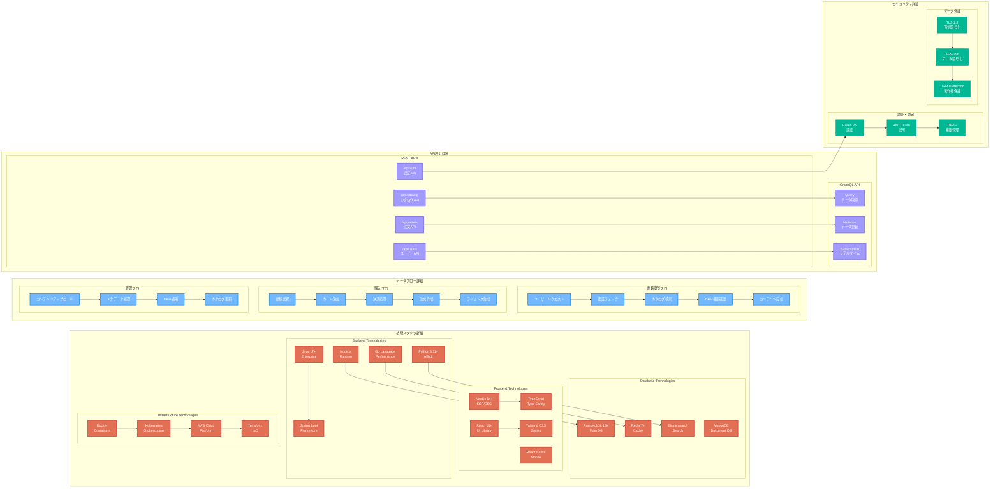

```mermaid
graph LR
    %% 技術スタック詳細図
    subgraph TechStack["技術スタック詳細"]
        
        subgraph FrontendTech["Frontend Technologies"]
            NextJS["Next.js 14+<br/>SSR/SSG"]
            React["React 18+<br/>UI Library"]
            TypeScript["TypeScript<br/>Type Safety"]
            TailwindCSS["Tailwind CSS<br/>Styling"]
            ReactNative["React Native<br/>Mobile"]
        end

        subgraph BackendTech["Backend Technologies"]
            NodeJS["Node.js<br/>Runtime"]
            Go["Go Language<br/>Performance"]
            Java["Java 17+<br/>Enterprise"]
            Python["Python 3.11+<br/>AI/ML"]
            SpringBoot["Spring Boot<br/>Framework"]
        end

        subgraph DatabaseTech["Database Technologies"]
            PostgreSQL["PostgreSQL 15+<br/>Main DB"]
            Redis["Redis 7+<br/>Cache"]
            Elasticsearch["Elasticsearch<br/>Search"]
            MongoDB["MongoDB<br/>Document DB"]
        end

        subgraph InfraTech["Infrastructure Technologies"]
            Docker["Docker<br/>Containers"]
            K8s["Kubernetes<br/>Orchestration"]
            AWS["AWS Cloud<br/>Platform"]
            Terraform["Terraform<br/>IaC"]
        end
    end

    %% データフロー詳細
    subgraph DataFlow["データフロー詳細"]
        
        subgraph ReadFlow["書籍閲覧フロー"]
            UserRequest[ユーザーリクエスト]
            AuthCheck[認証チェック]
            CatalogQuery[カタログ検索]
            DRMCheck[DRM権限確認]
            ContentDelivery[コンテンツ配信]
        end

        subgraph PurchaseFlow["購入フロー"]
            SelectBook[書籍選択]
            AddToCart[カート追加]
            Checkout[決済処理]
            OrderCreate[注文作成]
            LicenseGenerate[ライセンス生成]
        end

        subgraph AdminFlow["管理フロー"]
            ContentUpload[コンテンツアップロード]
            MetadataProcess[メタデータ処理]
            DRMApply[DRM適用]
            CatalogUpdate[カタログ更新]
        end
    end

    %% API設計詳細
    subgraph APIDesign["API設計詳細"]
        
        subgraph RESTAPIs["REST APIs"]
            AuthAPI["/api/auth<br/>認証API"]
            CatalogAPI["/api/catalog<br/>カタログAPI"]
            OrderAPI["/api/orders<br/>注文API"]
            UserAPI["/api/users<br/>ユーザーAPI"]
        end

        subgraph GraphQLAPI["GraphQL API"]
            QueryAPI["Query<br/>データ取得"]
            MutationAPI["Mutation<br/>データ更新"]
            SubscriptionAPI["Subscription<br/>リアルタイム"]
        end
    end

    %% セキュリティ詳細
    subgraph Security["セキュリティ詳細"]
        
        subgraph AuthSecurity["認証・認可"]
            OAuth2["OAuth 2.0<br/>認証"]
            JWT["JWT Token<br/>認可"]
            RBAC["RBAC<br/>権限管理"]
        end

        subgraph DataSecurity["データ保護"]
            TLS["TLS 1.3<br/>通信暗号化"]
            AES["AES-256<br/>データ暗号化"]
            DRMProtection["DRM Protection<br/>著作権保護"]
        end
    end

    %% 接続関係
    UserRequest --> AuthCheck
    AuthCheck --> CatalogQuery
    CatalogQuery --> DRMCheck
    DRMCheck --> ContentDelivery

    SelectBook --> AddToCart
    AddToCart --> Checkout
    Checkout --> OrderCreate
    OrderCreate --> LicenseGenerate

    ContentUpload --> MetadataProcess
    MetadataProcess --> DRMApply
    DRMApply --> CatalogUpdate

    %% 技術関連
    NextJS --> TypeScript
    React --> TailwindCSS
    NodeJS --> PostgreSQL
    Go --> Redis
    Java --> SpringBoot
    Python --> Elasticsearch

    Docker --> K8s
    K8s --> AWS
    AWS --> Terraform

    %% API関連
    AuthAPI --> OAuth2
    CatalogAPI --> QueryAPI
    OrderAPI --> MutationAPI
    UserAPI --> SubscriptionAPI

    %% セキュリティ関連
    OAuth2 --> JWT
    JWT --> RBAC
    TLS --> AES
    AES --> DRMProtection

    %% スタイリング
    classDef tech fill:#e17055,stroke:#d63031,stroke-width:2px,color:#fff
    classDef flow fill:#74b9ff,stroke:#0984e3,stroke-width:2px,color:#fff
    classDef api fill:#a29bfe,stroke:#6c5ce7,stroke-width:2px,color:#fff
    classDef security fill:#00b894,stroke:#00a085,stroke-width:2px,color:#fff

    class NextJS,React,TypeScript,TailwindCSS,ReactNative,NodeJS,Go,Java,Python,SpringBoot,PostgreSQL,Redis,Elasticsearch,MongoDB,Docker,K8s,AWS,Terraform tech
    class UserRequest,AuthCheck,CatalogQuery,DRMCheck,ContentDelivery,SelectBook,AddToCart,Checkout,OrderCreate,LicenseGenerate,ContentUpload,MetadataProcess,DRMApply,CatalogUpdate flow
    class AuthAPI,CatalogAPI,OrderAPI,UserAPI,QueryAPI,MutationAPI,SubscriptionAPI api
    class OAuth2,JWT,RBAC,TLS,AES,DRMProtection security
```